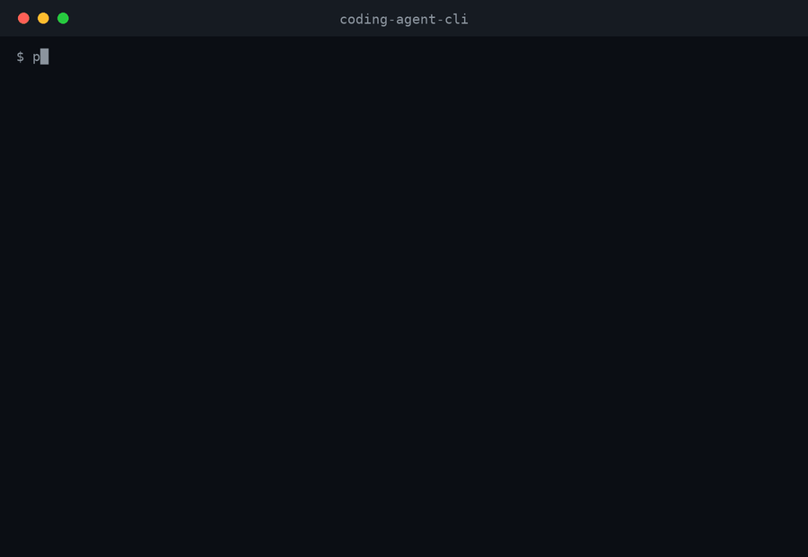
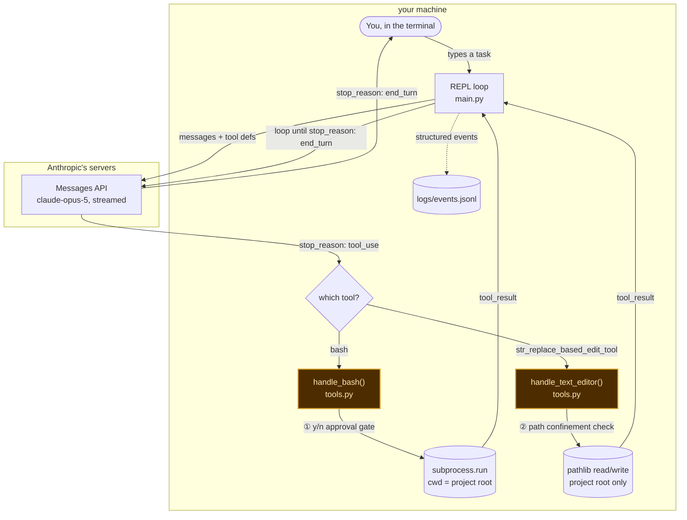
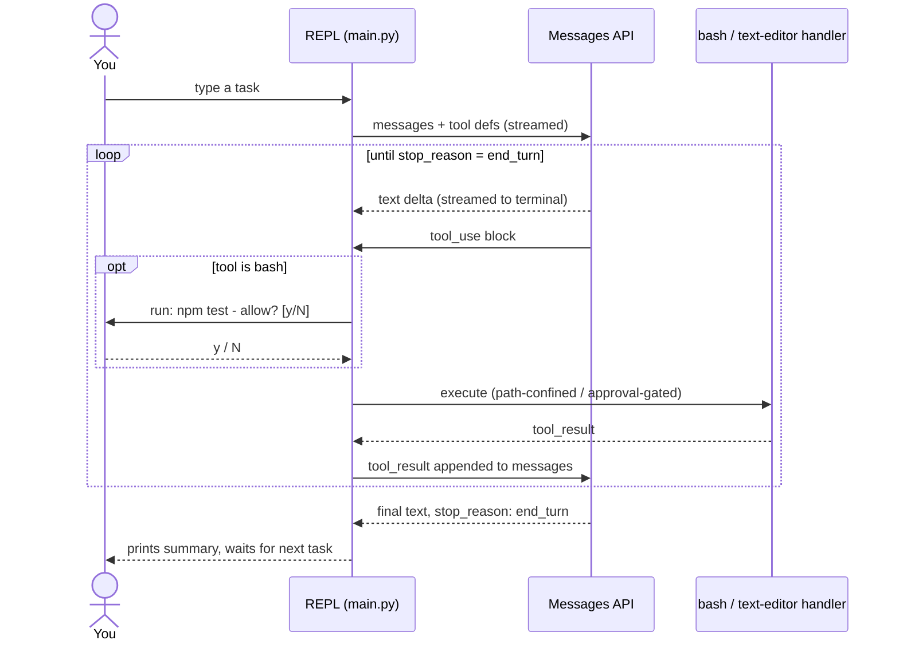

# coding-agent-cli

A minimal coding agent, built directly on the Anthropic Messages API with no
framework in between. It's a terminal REPL that can read, write, and edit
files and run shell commands in whatever directory you launch it from - the
same category of tool as Claude Code, GitHub Copilot's agent mode, or
Cursor's agent - stripped down to about 400 lines, most of them comments,
in plain Python.

This is explicitly a *learning* project, not a product. It exists to answer
one question honestly: strip away the framework, the polish, and the
managed infrastructure - what's actually left? The answer turns out to be
small enough to read in one sitting, which is the whole point. It started
as a TypeScript version; it's Python now because Python reads closer to
pseudocode, and the entire goal here is "understand every line," not "admire
the type system."

## Demo



*This is a scripted re-creation of the exact transcript in the [Usage](#usage)
section below, drawn frame-by-frame with [`scripts/make_demo_gif.py`](./scripts/make_demo_gif.py)
- not a screen recording. It's here so the shape of a session is obvious
before you read a line of code: a task in, a tool call with an approval
gate, a result, a summary.*

## Why this exists

- Every AI coding tool you've used is some variation of the same primitive
  loop: send the model a conversation and a list of tools it's allowed to
  call.
- If it asks to call one, run it and hand the result back; repeat until it
  stops asking.
- Frameworks exist to make that loop convenient - LangChain-style agent
  runtimes, the Claude Agent SDK, Anthropic's own beta Tool Runner - adding
  retries, streaming ergonomics, context management, built-in tool
  implementations.
- Convenient is the right call in production, but it also means the loop
  itself is invisible by the time you're using any of those.
- This repo goes the other direction on purpose: no `tool_runner`, no
  agent SDK, no hidden retry logic.
- `main.py` *is* the loop - there's nowhere else for the control flow to
  hide.
- If you've ever wondered what Claude Code is actually doing between you
  pressing enter and a file changing on disk: this is that, minus years of
  hardening.

## Architecture



Reading it:

- **The box around each half is the trust boundary**, not just visual
  grouping - it's the same "your repos vs. the model's servers" split the
  [Threat model](#threat-model) section is built around.
- **The two highlighted nodes (① ②) are the ones with a safety check in
  front of them** - `handle_bash` behind the approval prompt,
  `handle_text_editor` behind the path-confinement check. Every other node
  runs unconditionally.
- **Cylinders are external resources being touched** (your shell, your
  filesystem); rectangles are pure code; the diamond is the one branch
  point in the whole system.
- GitHub renders this as a pan/zoom-able SVG natively (drag to move, scroll
  or pinch to zoom) - no extra tooling needed to read the detail. Node
  labels deliberately aren't click-through links to the source files:
  GitHub's Mermaid renderer currently blocks that (`click` either gets
  flagged as blocked content or 404s on a relative path, since the diagram
  renders inside a sandboxed iframe) - the file table right below does that
  job instead, reliably.
- **The dotted edge is a side-channel, not the main request loop** - as the
  REPL runs, it also writes a structured event to `logs/events.jsonl`;
  that's a fire-and-forget write, not something anything downstream reads
  back. See [Observability](#observability).

The whole system is two files:

| File | Responsibility |
|---|---|
| [`main.py`](./main.py) | The REPL and the agentic loop itself: streams a response, inspects `stop_reason`, dispatches `tool_use` blocks, feeds `tool_result`s back, repeats. |
| [`tools.py`](./tools.py) | Everything that actually touches your machine: the bash executor, the text-editor command handlers, and the path-confinement logic that gates both. |

There's no third layer. No planner, no memory store, no vector index, no
sub-agents. The conversation list *is* the state.

## How the loop actually works

The diagram above shows the pieces; this shows the same system over time -
one full turn, including the approval interrupt sitting in the middle of it:



Note the `opt` block: the approval prompt only happens for `bash` calls, and
it's a genuine round-trip to a human sitting inside the loop - the API call
that started the turn doesn't resume until you answer it. Everything else
in that `loop` runs unattended.

Stripped to its essence, `run_turn()` in `main.py` does this:

```python
while True:
    with client.messages.stream(model=MODEL, max_tokens=MAX_TOKENS, tools=TOOLS, messages=messages) as stream:
        message = stream.get_final_message()

    messages.append({"role": "assistant", "content": message.content})

    calls = [block for block in message.content if block.type == "tool_use"]
    if not calls:
        break  # model is done - stop_reason: end_turn

    results = [execute_tool(c.name, c.input) for c in calls]  # simplified - see tools.py
    messages.append({"role": "user", "content": results})
    # loop back around - Claude sees the results and decides what's next
```

The API is stateless - `messages` is the entire memory of the conversation,
resent in full on every turn, which is *why* it's a list you keep appending
to rather than a session object. A few `stop_reason` values get explicit
handling beyond the tool-use path:

- **`end_turn`** - the model is finished; break out and prompt for the next task.
- **`tool_use`** - one or more tools were requested; dispatch, collect results, continue the loop.
- **`pause_turn`** - a server-side tool (not used here, but part of the contract) hit an internal continuation point; re-send and keep going.
- **`refusal`** - the model declined on policy grounds; `stop_details.category` says why.
- **`max_tokens`** - the response got cut off by the `MAX_TOKENS` cap; the CLI tells you so instead of silently truncating.

## Tools this harness supports

Just two - both **Anthropic-defined tools**, not custom ones with a
hand-written JSON Schema. That's the first design decision worth
explaining:

- **Why Anthropic-defined, not custom-schema.** `bash_20250124` and
  `text_editor_20250728` are schema-less - the tool definition is just
  `{"type": ..., "name": ...}`, no `input_schema` at all, because the model
  already knows the input shape from training.
- **Why *these specific* two, and not more.** They're the minimum pair
  needed to make "read code, run code, edit code" possible at all. A
  narrower custom tool (`run_tests`, `git_commit`, `lint_file`) would just
  be shell in a smaller costume; a broader one (an MCP client, a
  `git_commit` tool with its own message-formatting rules) is scope creep
  for a project whose stated goal is *understand the loop*, not *cover
  every workflow*. See [Known limitations](#known-limitations-non-goals-not-oversights).
- **Why it matters that they're the *same* tools Claude Code exposes.**
  Claude has substantially more real-world practice with exactly these two
  tool shapes than with an equivalent custom one - measurably better
  behavior for free, not just less code to write.

### `bash` (`bash_20250124`)

- **What it does:** runs one shell command via `subprocess.run(..., shell=True)`,
  with `cwd` pinned to the project root, a 120-second timeout, and output
  capped at 10MB.
- **Why bash and not a narrower tool:** real coding tasks need arbitrary
  shell access - installing a dependency, running whatever the project's
  test runner happens to be, `grep`, `git status`. Restricting that to a
  fixed menu of pre-approved actions would make the tool useless for
  anything the menu didn't anticipate.
- **What comes back:** combined stdout+stderr, always, success or failure.
  A non-zero exit isn't an exception the loop has to catch - it's just text
  the model reads and reacts to, the same way you'd read a red terminal.
- **The guardrail:** every command requires an interactive `y`/`N` before
  it runs (see [Threat model](#threat-model)).

### `str_replace_based_edit_tool` (`text_editor_20250728`)

- **What it does:** four commands - `view` (read a file or a line range),
  `create` (write a new file, backing up an existing one to `.bak` first),
  `str_replace` (swap one exact, unique substring), `insert` (add a line
  after a given line number).
- **Why `str_replace` specifically, over just handing the model a raw
  `Path.write_text()`:** it forces the model to express an edit as an
  old-string/new-string pair instead of silently rewriting a whole file. If
  `old_str` matches zero times or more than once, the tool hard-fails
  instead of guessing which occurrence was meant - a smaller, more
  reviewable diff surface than "here's the new file contents, trust me."
- **The guardrail:** every path is resolved and confined to the project
  root before any filesystem call runs (see [Threat model](#threat-model)).

## Threat model

The model generates commands and file paths; this process is what actually
executes them. That's the entire risk surface. In bullets, not paragraphs:

**Treated as untrusted input**
- Every `path` in a `tool_use` block.
- Every shell `command` in a `tool_use` block.
- Nothing upstream sanitizes either before this code sees them.

**Mitigated, and how**
- *Path traversal / symlink escape* → `resolve_within_root()` in
  `tools.py` resolves the model's path against the project root with
  `Path.resolve()`, which normalizes `..` segments and follows symlinks for
  every path component that already exists, then checks the result is
  still `.is_relative_to()` the root - one stdlib call does what the
  original version needed a manual loop for.
- *No file op bypasses the check* - there's no code path in `tools.py`
  that touches a path without going through `resolve_within_root()` first.
- *Unattended shell execution* → every bash command is printed and
  requires an explicit `y` before it runs. This is the primary control,
  not a backstop.

**Not mitigated - on purpose**
- *No command allowlist.* Blocking pipes, `&&`, backticks, or arbitrary
  binaries would also block most of what makes a shell tool useful
  (`grep | wc -l`, `npm test && npm run build`). The y/n gate exists
  *because* the command surface is unrestricted.
- *`AUTO_APPROVE_BASH=true` removes that gate entirely.* If you set it,
  you are personally taking on the role the allowlist would otherwise
  play - only do this in a directory you'd hand unattended shell access to.
- *No sandboxing.* No container, no VM, no seccomp profile. `bash` runs
  with your real user's permissions in your real shell environment. Path
  confinement only covers the *editor* tool - an approved bash command can
  still run `rm -rf ../something`, because that's a completely ordinary
  shell command from bash's point of view.
- *No prompt-injection defense.* If a file the model reads, or a command's
  output, contains text engineered to look like new instructions, nothing
  here distinguishes "content the model is looking at" from "instructions
  the model should follow" - because the model itself doesn't reliably
  distinguish that either. Open problem industry-wide, not something a
  400-line harness solves.
- *Tool output now gets written to a second place.* Since [Observability](#observability)
  was added, a truncated preview of every tool result - which can include
  real file contents or command output - is written to `logs/events.jsonl`
  on disk. `logs/` is gitignored, but the file itself isn't encrypted,
  access-controlled, or auto-deleted; treat it the way you'd treat shell
  history.

## Where this sits relative to the "real" options

There isn't one correct way to build a Claude-powered agent - there's a
harness axis (who writes the loop) and a deployment axis (who hosts it).
This project is the "write it yourself" corner of that space, deliberately:

| Approach | Who writes the loop | Who hosts it | This repo? |
|---|---|---|---|
| Manual loop (this repo) | You | You | ✅ |
| Anthropic Tool Runner (`client.beta.messages.tool_runner`) | SDK | You | — |
| Claude Agent SDK (Claude Code as a library) | SDK | You | — |
| Managed Agents | Anthropic | Anthropic | — |

If you want the loop's convenience without losing the "own the whole
thing" property, the Tool Runner is the natural next step - same tools,
`client.beta.messages.tool_runner(model=MODEL, tools=TOOLS, messages=messages)`
replaces the entire `while True:` loop. That was left out here on purpose
so the loop stays visible.

## Observability

Every turn writes structured events to `logs/events.jsonl` - one JSON
object per line, gitignored, since it's a runtime artifact and not source.
That's the entirety of [`observability.py`](./observability.py)'s job: a
dependency-free, `grep`-it-yourself event log instead of a real tracing
stack.

What gets logged, all tagged with a `session_id` (one per `python main.py`
run) and a `trace_id` (one per turn within that run), so
`grep <trace_id> logs/events.jsonl` reconstructs one turn, in order, from
a flat file with no other tooling:

| Event | When | Fields |
|---|---|---|
| `turn_start` | a task is submitted | a truncated preview of the task text |
| `api_call` | after every Messages API response | model, `stop_reason`, latency, `input_tokens` / `output_tokens` / `cache_read_input_tokens` |
| `tool_call` | after every tool finishes running | which tool, how long it took, a truncated result preview, a heuristic success flag |
| `turn_end` | the turn is done | total tool calls, total wall-clock time |
| `error` | anything escapes `run_turn()` uncaught | auth failure, rate limit, Ctrl+C |

One real line (pretty-printed here - the actual file is one line per event):

```json
{"ts": 1787342493.71, "session_id": "3c394815fcc8", "trace_id": "a48e00d00566",
 "event": "api_call", "model": "claude-opus-5", "stop_reason": "tool_use",
 "latency_ms": 842.3, "input_tokens": 1204, "output_tokens": 96,
 "cache_read_input_tokens": 0}
```

### Turning that into a report: `session_report.py`

`logs/events.jsonl` accumulates across every run, so [`session_report.py`](./session_report.py)
groups it by `session_id` and turns one run into an actual page instead of
a file you'd otherwise read with `jq`:

```bash
python session_report.py                # the most recent session
python session_report.py --all           # list every session in the log
python session_report.py --session <id>  # a specific one
```

It writes `logs/session_report.html` - stat tiles for the session (turns,
estimated cost, total tokens, tool calls), a per-turn bar chart splitting
input vs. output tokens with the estimated cost of each turn labeled
alongside it, and a detail table. A turn that errored out shows as a red
bar and a `FAIL` status instead of being silently dropped from the report.
Dollar figures come from [`pricing.py`](./pricing.py) - a small, hardcoded,
point-in-time rate table (documented there as exactly that: an estimate,
not your invoice).

**Why a flat file instead of OpenTelemetry/Honeycomb/Langfuse/etc.:** those
all solve the same underlying problem - what happened, in what order, how
long did it take, at what cost - just at a scale this project doesn't
operate at. A single local process writing to a single local file needs
exactly zero new infrastructure to be observable; the moment more than one
person or more than one machine needs to read these events, a real backend
earns its complexity.

**What this deliberately doesn't do** - the honest gap between "logging"
and "observability" at production scale:
- No exporting anywhere - the events never leave `logs/events.jsonl`. No
  dashboards, no alerting, no distributed tracing across processes.
- No retention policy. The file only grows; nothing rotates or caps it.
- No aggregation *across sessions* - `session_report.py` reports on one
  `python main.py` run at a time. "$ spent this week" across every session
  in the log is still a `jq`/`awk` exercise left to you.
- Pricing is a hardcoded snapshot in `pricing.py`, not a live lookup - see
  that file's own docstring for what to do when it drifts out of date.

## Measuring accuracy

"Accuracy" doesn't mean what it means for a classifier here - there's no
single correct label to score a response against, because an agent's
output is a *sequence of actions*, not a value. A few different signals
each answer a different piece of "is this agent doing a good job," and
this project only fully implements one of them - being explicit about
which is more useful than pretending there's a single number:

**Implemented: task-level pass/fail via a golden-task eval harness ([`evals/run_evals.py`](./evals/run_evals.py))**
- 4 small, hand-written tasks - add a `.gitignore`, do arithmetic via
  `bash`, edit a file with `str_replace`, chain a file-create with a
  `bash` append - each with a known-correct end state.
- Each task runs against the *real* CLI, as an actual `python main.py`
  subprocess (not internals imported and called directly), in its own
  throwaway temp directory, with `AUTO_APPROVE_BASH=true` so it can run
  unattended. The result gets checked against the exact expected file
  state, and the run's own `logs/events.jsonl` gets read back for the
  tool-call count, token usage, and duration shown in the report.
- Run it: `python evals/run_evals.py`. It needs a real `ANTHROPIC_API_KEY`
  and makes several real API calls - it costs actual money and time, which
  is exactly why it isn't wired into CI, the same way the sibling
  `github-repo-mcp-server` project in this account keeps its one live-API
  smoke test manual-only.
- "Accuracy" here = `pass_count / total_count`. Simple and deterministic,
  and only as good as the 4 tasks it happens to check - extending it means
  writing another `check()` function in that file, not touching the
  harness itself.
- Every run also appends one line to `evals/history.jsonl` (accuracy,
  per-task results, token totals, estimated cost) - it's never overwritten,
  so runs stay comparable across changes to the harness.

**Implemented: the trend across runs ([`evals/report.py`](./evals/report.py))**
- Reads `evals/history.jsonl` and renders `evals/report.html`: latest
  accuracy plus its delta from the previous run, an accuracy-over-runs
  line chart, a cost-over-runs line chart, and a full run history table.
- This is the answer to "did my last change make the agent better or
  worse" - a single run's stdout table can tell you *that* run's result,
  not whether it's an improvement.
- Run it: `python evals/report.py`, any time after at least one
  `run_evals.py` run (it says so and exits cleanly if there isn't one yet
  - a single run also renders fine, just with a note that the trend charts
  need a second data point).

**Signals already sitting in the logs, not yet turned into a report:**
- *Tool-call success rate* - `tool_call` events already carry a
  `looks_successful` heuristic; aggregating it across a session would give
  "% of tool calls that didn't error," a cheap proxy for how often the
  model's actions actually work.
- *Decline rate* - how often you say `N` at the bash approval prompt. A
  model whose proposed commands you keep declining is proposing the wrong
  action, which is a real accuracy signal, and it's already visible by
  grepping the logs for the decline result text.
- *Tool calls per task, over time* - more loop iterations to do the same
  kind of task can mean the model is thrashing, not being more thorough.

**Not implemented - a real next step, not something this project needed to cover:**
- *LLM-as-judge.* Have a separate Claude call read the full transcript and
  the resulting diff, then grade it against a rubric - did it accomplish
  the task, did it touch files it shouldn't have, was its summary accurate.
  This is the standard approach once tasks stop having one checkable end
  state ("did it refactor this well" doesn't reduce to a file existing).
  The 4 golden tasks here were deliberately picked to avoid needing it.
- *Human review at scale.* Fine for grading 4 tasks by hand while writing
  them; doesn't scale past that without either LLM-as-judge or a much
  larger library of still-deterministic `check()` functions.

## Setup

```bash
python3 -m venv .venv && source .venv/bin/activate   # optional but recommended
pip install -r requirements.txt
cp .env.example .env   # then fill in ANTHROPIC_API_KEY
python main.py
```

Requires Python 3.10+ (uses `Path.is_relative_to()` and `X | None` type
hints). `python -m py_compile main.py tools.py` is a fast way to check both
files parse without actually running the CLI.

## Usage

```
$ python main.py
coding-agent-cli - basic coding harness (claude-opus-5)
project root: /Users/you/scratch/test-project
type a task, or "exit" to quit

> add a .gitignore for a node project

[str_replace_based_edit_tool] create .gitignore
Created .gitignore

Done - added a .gitignore covering node_modules, dist, and .env.

> run the tests

  run: npm test
  allow? [y/N] y

[bash] npm test
...
All 12 tests passed.

Tests are passing - no changes needed.

> exit
```

(This is also what [`docs/demo.gif`](./docs/demo.gif) shows, animated - see [Demo](#demo) above.)

It operates on whatever directory you launched `python main.py` from -
that directory *is* the project it can see and edit, for the reasons in
the threat model above. Point it at a disposable test folder the first
time you run it, not something you'd mind losing.

## Configuration (`.env`)

| Variable | Default | What it does |
|---|---|---|
| `ANTHROPIC_API_KEY` | *(required)* | Your Anthropic API key. Get one at [console.anthropic.com](https://console.anthropic.com/settings/keys). |
| `CLAUDE_MODEL` | `claude-opus-5` | Model ID to use for every request. |
| `MAX_TOKENS` | `8192` | Per-response token ceiling. Raised responses cost more and take longer to stream; lowered ones risk mid-thought truncation (the CLI will tell you when this happens). |
| `AUTO_APPROVE_BASH` | `false` | Skip the y/n prompt before every bash command. See [Threat model](#threat-model) before touching this. |

## Project layout

```
coding-agent-cli/
├── main.py                          # REPL + the agentic loop
├── tools.py                         # bash + text-editor handlers, path confinement
├── observability.py                 # structured JSONL event logging (see Observability)
├── session_report.py                # logs/events.jsonl -> a per-turn token/cost report
├── pricing.py                       # $/token rates, shared by both reports below
├── report_style.py                  # shared HTML/CSS + chart helpers for both reports
├── evals/
│   ├── run_evals.py                  # golden-task accuracy harness (see Measuring accuracy)
│   ├── report.py                     # evals/history.jsonl -> an accuracy/cost trend report
│   └── history.jsonl                 # gitignored - one line per run_evals.py run
├── docs/
│   └── demo.gif                     # the animated session in the Demo section
├── scripts/
│   └── make_demo_gif.py             # regenerates docs/demo.gif (pip install pillow)
├── logs/                             # gitignored - events.jsonl and generated reports land here
├── requirements.txt
├── .env.example
├── WORKLOG.md                        # dated log of what changed and why
└── README.md
```

## Known limitations (non-goals, not oversights)

These are absent because adding them would turn a project meant to be
readable end-to-end into a second, larger project - not because they were
missed:

- **No persistence.** Conversation history lives in a single in-memory
  list and is gone the moment the process exits. There's no session file,
  no resume.
- **No context management.** Long sessions will eventually hit the model's
  context window with no compaction or trimming strategy in place.
- **No MCP client.** This harness only calls the two hardcoded local tools
  - it doesn't speak the Model Context Protocol to reach anything external.
- **No unit tests, no CI.** [`evals/run_evals.py`](./evals/run_evals.py)
  covers 4 end-to-end tasks against the real CLI (see
  [Measuring accuracy](#measuring-accuracy)), but nothing tests `tools.py`'s
  individual functions in isolation, and nothing runs automatically on
  push - both the evals and the manual verification behind each change
  stay opt-in.
- **No sub-agents, no parallelism beyond one turn's tool calls.** One
  conversation, one model, one thread of control.

If you want any of these, they're reasonable next steps, not bugs to file
here.

## Troubleshooting

- **`Missing ANTHROPIC_API_KEY`** - `.env` wasn't created or the key wasn't
  set. Confirm `cp .env.example .env` actually ran and the file has a real
  key in it (the CLI loads it via `load_dotenv()` at startup).
- **`Authentication failed`** - the key is present but invalid or revoked;
  regenerate one from the Anthropic console.
- **`Rate limited`** - back off and retry; there's no automatic retry loop
  here (deliberately - see Known limitations).
- **Tool result says "resolves outside the project root"** - the model
  tried to touch a path outside where you launched the CLI. This is the
  path-confinement check working as intended, not a bug to work around.
- **Nothing happens after approving a bash command** - long-running or
  interactive commands (anything that waits on stdin, like an unflagged
  `git commit`) will hang until the 120-second `subprocess.run` timeout
  fires, since this harness doesn't attach an interactive TTY to the child
  process.

## Work log

[`WORKLOG.md`](./WORKLOG.md) is a dated log of what changed in this repo
and why, session by session - useful for "what did I even do last time"
in a way a commit list alone isn't, since it keeps the reasoning, not just
the diff.

## License

MIT
