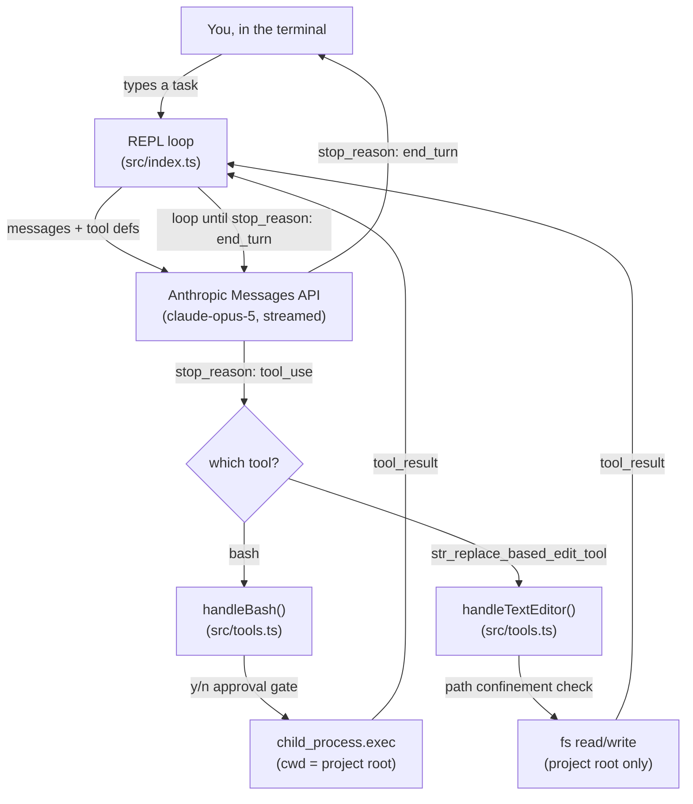

# coding-agent-cli

A minimal coding agent, built directly on the Anthropic Messages API with no
framework in between. It's a terminal REPL that can read, write, and edit
files and run shell commands in whatever directory you launch it from - the
same category of tool as Claude Code, GitHub Copilot's agent mode, or
Cursor's agent - stripped down to the ~230 lines that make that category of
tool work at all.

This is explicitly a *learning* project, not a product. It exists to answer
one question honestly: strip away the framework, the polish, and the
managed infrastructure - what's actually left? The answer turns out to be
small enough to read in one sitting, which is the whole point.

## Demo


*This is a scripted re-creation of the exact transcript in the [Usage](#usage)
section below, drawn frame-by-frame with [`scripts/make_demo_gif.py`](./scripts/make_demo_gif.py)
- not a screen recording. It's here so the shape of a session is obvious
before you read a line of code: a task in, a tool call with an approval
gate, a result, a summary.*

## Why this exists

- Every AI coding tool you've used is some variation of the same primitive
  loop: send the model a conversation and a list of tools it's allowed to
  call.
- If it asks to call one, run it and hand the result back; repeat until it
  stops asking.
- Frameworks exist to make that loop convenient - LangChain-style agent
  runtimes, the Claude Agent SDK, Anthropic's own beta Tool Runner - adding
  retries, streaming ergonomics, context management, built-in tool
  implementations.
- Convenient is the right call in production, but it also means the loop
  itself is invisible by the time you're using any of those.
- This repo goes the other direction on purpose: no `tool_runner`, no
  agent SDK, no hidden retry logic.
- `src/index.ts` *is* the loop - there's nowhere else for the control flow
  to hide.
- If you've ever wondered what Claude Code is actually doing between you
  pressing enter and a file changing on disk: this is that, minus years of
  hardening.

## Architecture



The whole system is two files:

| File | Responsibility |
|---|---|
| [`src/index.ts`](./src/index.ts) | The REPL and the agentic loop itself: streams a response, inspects `stop_reason`, dispatches `tool_use` blocks, feeds `tool_result`s back, repeats. |
| [`src/tools.ts`](./src/tools.ts) | Everything that actually touches your machine: the bash executor, the text-editor command handlers, and the path-confinement logic that gates both. |

There's no third layer. No planner, no memory store, no vector index, no
sub-agents. The conversation array *is* the state.

## How the loop actually works

Stripped to its essence, `runTurn()` in `src/index.ts` does this:

```ts
while (true) {
  const message = await client.messages.stream({ model, tools, messages }).finalMessage();

  messages.push({ role: "assistant", content: message.content });

  const calls = message.content.filter(b => b.type === "tool_use");
  if (calls.length === 0) break;               // model is done - stop_reason: end_turn

  const results = await Promise.all(/* run each tool, collect tool_result blocks */);
  messages.push({ role: "user", content: results });
  // loop back around - Claude sees the results and decides what's next
}
```

The API is stateless - `messages` is the entire memory of the conversation,
resent in full on every turn, which is *why* it's an array you keep pushing
onto rather than a session object. A few `stop_reason` values get explicit
handling beyond the tool-use path:

- **`end_turn`** - the model is finished; break out and prompt for the next task.
- **`tool_use`** - one or more tools were requested; dispatch, collect results, continue the loop.
- **`pause_turn`** - a server-side tool (not used here, but part of the contract) hit an internal continuation point; re-send and keep going.
- **`refusal`** - the model declined on policy grounds; `stop_details.category` says why.
- **`max_tokens`** - the response got cut off by the `MAX_TOKENS` cap; the CLI tells you so instead of silently truncating.

## Tools this harness supports

Just two - both **Anthropic-defined tools**, not custom ones with a
hand-written JSON Schema. That's the first design decision worth
explaining:

- **Why Anthropic-defined, not custom-schema.** `bash_20250124` and
  `text_editor_20250728` are schema-less - the tool definition is just
  `{ type, name }`, no `input_schema` at all, because the model already
  knows the input shape from training.
- **Why *these specific* two, and not more.** They're the minimum pair
  needed to make "read code, run code, edit code" possible at all. A
  narrower custom tool (`run_tests`, `git_commit`, `lint_file`) would just
  be shell in a smaller costume; a broader one (an MCP client, a
  `git_commit` tool with its own message-formatting rules) is scope creep
  for a project whose stated goal is *understand the loop*, not *cover
  every workflow*. See [Known limitations](#known-limitations-non-goals-not-oversights).
- **Why it matters that they're the *same* tools Claude Code exposes.**
  Claude has substantially more real-world practice with exactly these two
  tool shapes than with an equivalent custom one - measurably better
  behavior for free, not just less code to write.

### `bash` (`bash_20250124`)

- **What it does:** runs one shell command via `child_process.exec`, with
  `cwd` pinned to the project root, a 120s timeout, and a 10MB output cap.
- **Why bash and not a narrower tool:** real coding tasks need arbitrary
  shell access - installing a dependency, running whatever the project's
  test runner happens to be, `grep`, `git status`. Restricting that to a
  fixed menu of pre-approved actions would make the tool useless for
  anything the menu didn't anticipate.
- **What comes back:** combined stdout+stderr, always, success or failure.
  A non-zero exit isn't an exception the loop has to catch - it's just text
  the model reads and reacts to, the same way you'd read a red terminal.
- **The guardrail:** every command requires an interactive `y`/`N` before
  it runs (see [Threat model](#threat-model)).

### `str_replace_based_edit_tool` (`text_editor_20250728`)

- **What it does:** four commands - `view` (read a file or a line range),
  `create` (write a new file, backing up an existing one to `.bak` first),
  `str_replace` (swap one exact, unique substring), `insert` (add a line
  after a given line number).
- **Why `str_replace` specifically, over just handing the model raw
  `fs.writeFile`:** it forces the model to express an edit as an
  old-string/new-string pair instead of silently rewriting a whole file. If
  `old_str` matches zero times or more than once, the tool hard-fails
  instead of guessing which occurrence was meant - a smaller, more
  reviewable diff surface than "here's the new file contents, trust me."
- **The guardrail:** every path is resolved and confined to the project
  root before any filesystem call runs (see [Threat model](#threat-model)).

## Threat model

The model generates commands and file paths; this process is what actually
executes them. That's the entire risk surface. In bullets, not paragraphs:

**Treated as untrusted input**
- Every `path` in a `tool_use` block.
- Every shell `command` in a `tool_use` block.
- Nothing upstream sanitizes either before this code sees them.

**Mitigated, and how**
- *Path traversal / symlink escape* → `resolveWithinRoot()` in
  `src/tools.ts` resolves the model's path against the project root and
  rejects anything that escapes it (`..`, an absolute path elsewhere on
  disk), including resolving symlinks on the nearest existing ancestor so a
  symlink planted inside the root can't point outside it.
- *No file op bypasses the check* - there's no code path that calls `fs.*`
  on a raw model-supplied string.
- *Unattended shell execution* → every bash command is printed and
  requires an explicit `y` before it runs. This is the primary control,
  not a backstop.

**Not mitigated - on purpose**
- *No command allowlist.* Blocking pipes, `&&`, backticks, or arbitrary
  binaries would also block most of what makes a shell tool useful
  (`grep | wc -l`, `npm test && npm run build`). The y/n gate exists
  *because* the command surface is unrestricted.
- *`AUTO_APPROVE_BASH=true` removes that gate entirely.* If you set it,
  you are personally taking on the role the allowlist would otherwise
  play - only do this in a directory you'd hand unattended shell access to.
- *No sandboxing.* No container, no VM, no seccomp profile. `bash` runs
  with your real user's permissions in your real shell environment. Path
  confinement only covers the *editor* tool - an approved bash command can
  still run `rm -rf ../something`, because that's a completely ordinary
  shell command from bash's point of view.
- *No prompt-injection defense.* If a file the model reads, or a command's
  output, contains text engineered to look like new instructions, nothing
  here distinguishes "content the model is looking at" from "instructions
  the model should follow" - because the model itself doesn't reliably
  distinguish that either. Open problem industry-wide, not something a
  230-line harness solves.

## Where this sits relative to the "real" options

There isn't one correct way to build a Claude-powered agent - there's a
harness axis (who writes the loop) and a deployment axis (who hosts it).
This project is the "write it yourself" corner of that space, deliberately:

| Approach | Who writes the loop | Who hosts it | This repo? |
|---|---|---|---|
| Manual loop (this repo) | You | You | ✅ |
| Anthropic Tool Runner (`client.beta.messages.toolRunner`) | SDK | You | — |
| Claude Agent SDK (Claude Code as a library) | SDK | You | — |
| Managed Agents | Anthropic | Anthropic | — |

If you want the loop's convenience without losing the "own the whole
thing" property, the Tool Runner is the natural next step - same tools,
`client.beta.messages.toolRunner({ model, tools, messages })` replaces the
entire `while (true)` block. That was left out here on purpose so the loop
stays visible.

## Setup

```bash
npm install
cp .env.example .env   # then fill in ANTHROPIC_API_KEY
npm start
```

Requires Node 20+. `npm run typecheck` runs `tsc --noEmit` under `strict`
(including `noUncheckedIndexedAccess`) if you want to verify the source
compiles without actually running it.

## Usage

```
$ npm start
coding-agent-cli - basic coding harness (claude-opus-5)
project root: /Users/you/scratch/test-project
type a task, or "exit" to quit

> add a .gitignore for a node project

[str_replace_based_edit_tool] create .gitignore
Created .gitignore

Done - added a .gitignore covering node_modules, dist, and .env.

> run the tests

  run: npm test
  allow? [y/N] y

[bash] npm test
...
All 12 tests passed.

Tests are passing - no changes needed.

> exit
```

(This is also what [`docs/demo.gif`](./docs/demo.gif) shows, animated - see [Demo](#demo) above.)

It operates on whatever directory you launched `npm start` from - that
directory *is* the project it can see and edit, for the reasons in the
threat model above. Point it at a disposable test folder the first time you
run it, not something you'd mind losing.

## Configuration (`.env`)

| Variable | Default | What it does |
|---|---|---|
| `ANTHROPIC_API_KEY` | *(required)* | Your Anthropic API key. Get one at [console.anthropic.com](https://console.anthropic.com/settings/keys). |
| `CLAUDE_MODEL` | `claude-opus-5` | Model ID to use for every request. |
| `MAX_TOKENS` | `8192` | Per-response token ceiling. Raised responses cost more and take longer to stream; lowered ones risk mid-thought truncation (the CLI will tell you when this happens). |
| `AUTO_APPROVE_BASH` | `false` | Skip the y/n prompt before every bash command. See [Threat model](#threat-model) before touching this. |

## Project layout

```
coding-agent-cli/
├── src/
│   ├── index.ts            # REPL + the agentic loop
│   └── tools.ts              # bash + text-editor handlers, path confinement
├── docs/
│   └── demo.gif                # the animated session in the Demo section
├── scripts/
│   └── make_demo_gif.py          # regenerates docs/demo.gif (pip install pillow)
├── package.json
├── tsconfig.json                   # strict mode, noUncheckedIndexedAccess
├── .env.example
└── README.md
```

## Known limitations (non-goals, not oversights)

These are absent because adding them would turn a project meant to be
readable end-to-end into a second, larger project - not because they were
missed:

- **No persistence.** Conversation history lives in a single in-memory
  array and is gone the moment the process exits. There's no session file,
  no resume.
- **No context management.** Long sessions will eventually hit the model's
  context window with no compaction or trimming strategy in place.
- **No MCP client.** This harness only calls the two hardcoded local tools
  - it doesn't speak the Model Context Protocol to reach anything external.
- **No test suite.** There's nothing here that isn't directly exercised by
  actually running the CLI; correctness was verified manually, not with CI.
- **No sub-agents, no parallelism beyond one turn's tool calls.** One
  conversation, one model, one thread of control.

If you want any of these, they're reasonable next steps, not bugs to file
here.

## Troubleshooting

- **`Missing ANTHROPIC_API_KEY`** - `.env` wasn't created or the key wasn't
  set. Confirm `cp .env.example .env` actually ran and the file has a real
  key in it (the CLI loads it via `dotenv/config` at startup).
- **`Authentication failed`** - the key is present but invalid or revoked;
  regenerate one from the Anthropic console.
- **`Rate limited`** - back off and retry; there's no automatic retry loop
  here (deliberately - see Known limitations).
- **Tool result says "resolves outside the project root"** - the model
  tried to touch a path outside where you launched the CLI. This is the
  path-confinement check working as intended, not a bug to work around.
- **Nothing happens after approving a bash command** - long-running or
  interactive commands (anything that waits on stdin, like an unflagged
  `git commit`) will hang until the 120s exec timeout fires, since this
  harness doesn't attach an interactive TTY to the child process.

## License

MIT
