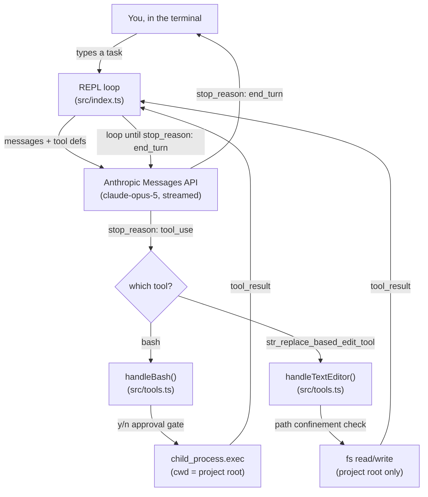

# coding-agent-cli

A minimal coding agent, built directly on the Anthropic Messages API with no
framework in between. It's a terminal REPL that can read, write, and edit
files and run shell commands in whatever directory you launch it from - the
same category of tool as Claude Code, GitHub Copilot's agent mode, or
Cursor's agent - stripped down to the ~230 lines that make that category of
tool work at all.

This is explicitly a *learning* project, not a product. It exists to answer
one question honestly: strip away the framework, the polish, and the
managed infrastructure - what's actually left? The answer turns out to be
small enough to read in one sitting, which is the whole point.

## Why this exists

Every AI coding tool you've used is some variation of the same primitive
loop: send the model a conversation and a list of tools it's allowed to
call; if it asks to call one, run it and hand back the result; repeat until
it stops asking. Frameworks (LangChain-style agent runtimes, the Claude
Agent SDK, Anthropic's own beta Tool Runner) exist to make that loop
convenient - retries, streaming ergonomics, context management, built-in
tool implementations. Convenient is good in production, but it also means
the loop itself is invisible by the time you're using any of those.

This repo goes the other direction on purpose: no `tool_runner`, no agent
SDK, no hidden retry logic. `src/index.ts` *is* the loop, and there is
nowhere else for the control flow to be. If you've ever wondered what
Claude Code is actually doing between you pressing enter and a file
changing on disk, this is that, minus years of hardening.

## Architecture



The whole system is two files:

| File | Responsibility |
|---|---|
| [`src/index.ts`](./src/index.ts) | The REPL and the agentic loop itself: streams a response, inspects `stop_reason`, dispatches `tool_use` blocks, feeds `tool_result`s back, repeats. |
| [`src/tools.ts`](./src/tools.ts) | Everything that actually touches your machine: the bash executor, the text-editor command handlers, and the path-confinement logic that gates both. |

There's no third layer. No planner, no memory store, no vector index, no
sub-agents. The conversation array *is* the state.

## How the loop actually works

Stripped to its essence, `runTurn()` in `src/index.ts` does this:

```ts
while (true) {
  const message = await client.messages.stream({ model, tools, messages }).finalMessage();

  messages.push({ role: "assistant", content: message.content });

  const calls = message.content.filter(b => b.type === "tool_use");
  if (calls.length === 0) break;               // model is done - stop_reason: end_turn

  const results = await Promise.all(/* run each tool, collect tool_result blocks */);
  messages.push({ role: "user", content: results });
  // loop back around - Claude sees the results and decides what's next
}
```

The API is stateless - `messages` is the entire memory of the conversation,
resent in full on every turn, which is *why* it's an array you keep pushing
onto rather than a session object. A few `stop_reason` values get explicit
handling beyond the tool-use path:

- **`end_turn`** - the model is finished; break out and prompt for the next task.
- **`tool_use`** - one or more tools were requested; dispatch, collect results, continue the loop.
- **`pause_turn`** - a server-side tool (not used here, but part of the contract) hit an internal continuation point; re-send and keep going.
- **`refusal`** - the model declined on policy grounds; `stop_details.category` says why.
- **`max_tokens`** - the response got cut off by the `MAX_TOKENS` cap; the CLI tells you so instead of silently truncating.

## The tools

Both tools are Anthropic-defined, not custom ones we wrote a JSON Schema
for. That's a deliberate choice: `bash_20250124` and `text_editor_20250728`
are schema-less - the model already knows their input shape from training,
so the tool definition is just `{ type, name }` with no `input_schema`.
Claude also has years of practice using exactly these two tool shapes,
because they're the same ones Claude Code itself exposes - which matters
more than it sounds like for behavior quality.

- **`bash`** (`handleBash`) - runs one command via `child_process.exec` with
  `cwd` pinned to the project root, a 120s timeout, and a 10MB output cap.
  Combined stdout+stderr goes back as the tool result, including on
  failure - a non-zero exit isn't an exception the loop has to catch, it's
  just text the model reads and reacts to, same as a human would reading a
  terminal.
- **`str_replace_based_edit_tool`** (`handleTextEditor`) - implements the
  four commands Claude can issue: `view` (read a file or a line range),
  `create` (write a new file, backing up an existing one to `.bak` first),
  `str_replace` (swap one exact, unique substring - it deliberately errors
  if `old_str` matches zero or more than once, rather than guessing), and
  `insert` (add a line after a given line number).

## Threat model

Worth being explicit about this rather than hand-wavy, since the entire
point of this tool is that a language model is generating commands and file
paths that your machine then executes:

**What's treated as untrusted input:** every `path` and every shell
`command` in a `tool_use` block. The model's output is not sanitized
upstream by Anthropic in any way that this codebase relies on - it's plain
text this process chooses to act on.

**What's mitigated, and how:**
- *Path traversal / symlink escape* - `resolveWithinRoot()` in
  `src/tools.ts` resolves the model-supplied path against the project root,
  rejects anything that lands outside it (`..`, an absolute path elsewhere
  on disk), and additionally resolves symlinks on the nearest existing
  ancestor so a symlink planted inside the root that points outside it is
  still caught. Every file operation goes through this - there's no code
  path that calls `fs.*` on a raw model-supplied string.
- *Unattended shell execution* - every bash command is echoed to the
  terminal and requires an explicit `y` before it runs. This is the
  primary control, not a backstop.

**What's explicitly *not* mitigated, on purpose:**
- *Command allowlisting.* There isn't one. A tool that blocked pipes,
  `&&`, backticks, or arbitrary binaries would also block most of what
  makes a shell tool useful for real coding tasks (`grep | wc -l`,
  `npm test && npm run build`, and so on). The y/n gate exists precisely
  *because* the command surface is unrestricted - if you automate approval
  (`AUTO_APPROVE_BASH=true`), you are personally taking on the role the
  allowlist would otherwise play. Do that only in a directory you'd hand
  root-in-that-directory access to.
- *Sandboxing.* No container, no VM, no seccomp profile, no filesystem
  overlay. `bash` runs with your actual user's permissions in your actual
  shell environment. The path confinement stops the *editor* tool from
  reaching outside the project root; it does nothing to stop a bash command
  you approve from doing so - `rm -rf ../something` is a normal shell
  command, and the approval prompt is the only thing standing between the
  model suggesting it and it running.
- *Prompt injection via tool output.* If a file the model reads (via
  `view`) or a command's output contains text engineered to look like new
  instructions, nothing here distinguishes "content the model is looking
  at" from "instructions the model should follow" - because the model
  itself doesn't reliably distinguish that either. This is a known open
  problem across the entire industry, not something a 230-line harness
  solves; be aware of it before pointing this at untrusted files.

If you're building past this project, `shared/agent-design.md` and
`shared/tool-use-concepts.md` in Anthropic's own docs are worth reading
before you loosen any of the above.

## Where this sits relative to the "real" options

There isn't one correct way to build a Claude-powered agent - there's a
harness axis (who writes the loop) and a deployment axis (who hosts it).
This project is the "write it yourself" corner of that space, deliberately:

| Approach | Who writes the loop | Who hosts it | This repo? |
|---|---|---|---|
| Manual loop (this repo) | You | You | ✅ |
| Anthropic Tool Runner (`client.beta.messages.toolRunner`) | SDK | You | — |
| Claude Agent SDK (Claude Code as a library) | SDK | You | — |
| Managed Agents | Anthropic | Anthropic | — |

If you want the loop's convenience without losing the "own the whole
thing" property, the Tool Runner is the natural next step - same tools,
`client.beta.messages.toolRunner({ model, tools, messages })` replaces the
entire `while (true)` block. That was left out here on purpose so the loop
stays visible.

## Setup

```bash
npm install
cp .env.example .env   # then fill in ANTHROPIC_API_KEY
npm start
```

Requires Node 20+. `npm run typecheck` runs `tsc --noEmit` under `strict`
(including `noUncheckedIndexedAccess`) if you want to verify the source
compiles without actually running it.

## Usage

```
$ npm start
coding-agent-cli - basic coding harness (claude-opus-5)
project root: /Users/you/scratch/test-project
type a task, or "exit" to quit

> add a .gitignore for a node project

[str_replace_based_edit_tool] create .gitignore
Created .gitignore

Done - added a .gitignore covering node_modules, dist, and .env.

> run the tests

  run: npm test
  allow? [y/N] y

[bash] npm test
...
All 12 tests passed.

Tests are passing - no changes needed.

> exit
```

It operates on whatever directory you launched `npm start` from - that
directory *is* the project it can see and edit, for the reasons in the
threat model above. Point it at a disposable test folder the first time you
run it, not something you'd mind losing.

## Configuration (`.env`)

| Variable | Default | What it does |
|---|---|---|
| `ANTHROPIC_API_KEY` | *(required)* | Your Anthropic API key. Get one at [console.anthropic.com](https://console.anthropic.com/settings/keys). |
| `CLAUDE_MODEL` | `claude-opus-5` | Model ID to use for every request. |
| `MAX_TOKENS` | `8192` | Per-response token ceiling. Raised responses cost more and take longer to stream; lowered ones risk mid-thought truncation (the CLI will tell you when this happens). |
| `AUTO_APPROVE_BASH` | `false` | Skip the y/n prompt before every bash command. See the threat model section before touching this. |

## Project layout

```
coding-agent-cli/
├── src/
│   ├── index.ts      # REPL + the agentic loop
│   └── tools.ts       # bash + text-editor handlers, path confinement
├── package.json
├── tsconfig.json      # strict mode, noUncheckedIndexedAccess
├── .env.example
└── README.md
```

## Known limitations (non-goals, not oversights)

These are absent because adding them would turn a project meant to be
readable end-to-end into a second, larger project - not because they were
missed:

- **No persistence.** Conversation history lives in a single in-memory
  array and is gone the moment the process exits. There's no session file,
  no resume.
- **No context management.** Long sessions will eventually hit the model's
  context window with no compaction or trimming strategy in place.
- **No MCP client.** This harness only calls the two hardcoded local tools
  - it doesn't speak the Model Context Protocol to reach anything external.
- **No test suite.** There's nothing here that isn't directly exercised by
  actually running the CLI; correctness was verified manually, not with CI.
- **No sub-agents, no parallelism beyond one turn's tool calls.** One
  conversation, one model, one thread of control.

If you want any of these, they're reasonable next steps, not bugs to file
here.

## Troubleshooting

- **`Missing ANTHROPIC_API_KEY`** - `.env` wasn't created or the key wasn't
  set. Confirm `cp .env.example .env` actually ran and the file has a real
  key in it (the CLI loads it via `dotenv/config` at startup).
- **`Authentication failed`** - the key is present but invalid or revoked;
  regenerate one from the Anthropic console.
- **`Rate limited`** - back off and retry; there's no automatic retry loop
  here (deliberately - see Known limitations).
- **Tool result says "resolves outside the project root"** - the model
  tried to touch a path outside where you launched the CLI. This is the
  path-confinement check working as intended, not a bug to work around.
- **Nothing happens after approving a bash command** - long-running or
  interactive commands (anything that waits on stdin, like an unflagged
  `git commit`) will hang until the 120s exec timeout fires, since this
  harness doesn't attach an interactive TTY to the child process.

## License

MIT
