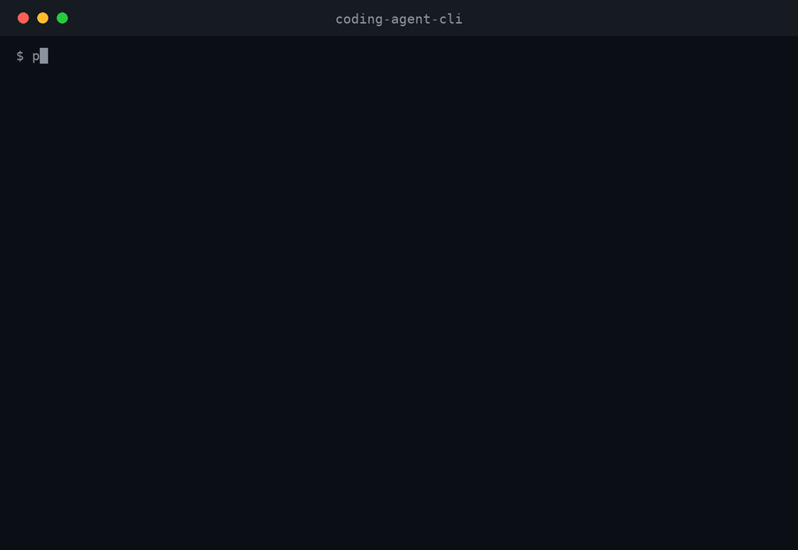
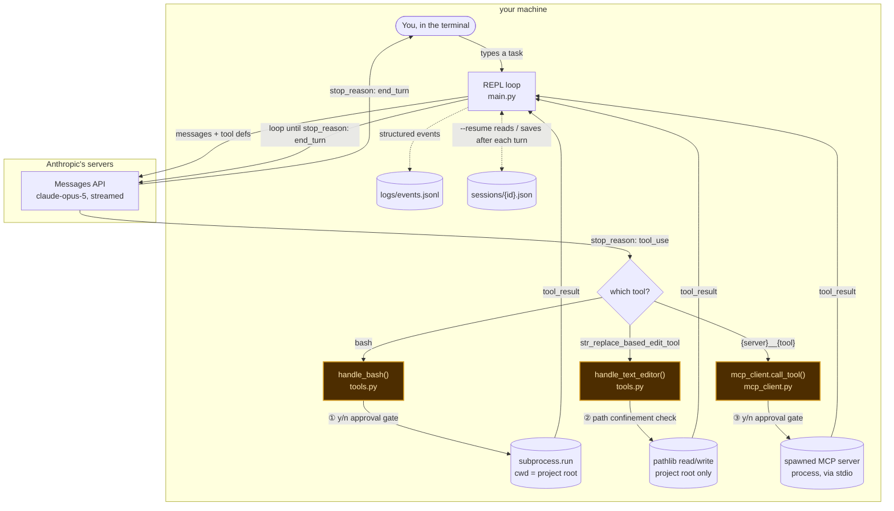

# coding-agent-cli

A minimal coding agent built directly on the Anthropic Messages API, with no
framework in between. A terminal REPL that reads, writes and edits files and
runs shell commands in whatever directory you launch it from — the same
category of tool as Claude Code or Cursor's agent mode, in ~1,150 lines of
plain Python across three files — a third of that comments.

A *learning* project, not a product. Strip away the framework and the managed
infrastructure, and what's left is small enough to read in one sitting.
That's the point.

**[docs/DESIGN.md](./docs/DESIGN.md)** has the full reasoning — why each
decision went the way it did, the complete threat model, and what's
deliberately missing. **[WORKLOG.md](./WORKLOG.md)** is the dated history.

## Demo



## Architecture


```mermaid
flowchart TD
    subgraph Local["your machine"]
        U(["You, in the terminal"])
        REPL["REPL loop\nmain.py"]
        Dispatch{"which tool?"}
        Bash["handle_bash()\ntools.py"]
        Editor["handle_text_editor()\ntools.py"]
        MCPClient["mcp_client.call_tool()\nmcp_client.py"]
        Shell[("subprocess.run\ncwd = project root")]
        FS[("pathlib read/write\nproject root only")]
        MCPServer[("spawned MCP server\nprocess, via stdio")]
        Logs[("logs/events.jsonl")]
        Sessions[("sessions/{id}.json")]
    end

    subgraph Remote["Anthropic's servers"]
        API["Messages API\nclaude-opus-5, streamed"]
    end

    U -->|"types a task"| REPL
    REPL -->|"messages + tool defs"| API
    API -->|"stop_reason: tool_use"| Dispatch
    Dispatch -->|"bash"| Bash
    Dispatch -->|"str_replace_based_edit_tool"| Editor
    Dispatch -->|"{server}__{tool}"| MCPClient
    Bash -->|"① y/n approval gate"| Shell
    Editor -->|"② path confinement check"| FS
    MCPClient -->|"③ y/n approval gate"| MCPServer
    Shell -->|"tool_result"| REPL
    FS -->|"tool_result"| REPL
    MCPServer -->|"tool_result"| REPL
    REPL -->|"loop until stop_reason: end_turn"| API
    API -->|"stop_reason: end_turn"| U
    REPL -.->|"structured events"| Logs
    REPL <-.->|"--resume reads / saves after each turn"| Sessions

    classDef guarded fill:#4d2d00,stroke:#d29922,color:#ffe7b3,stroke-width:2px
    class Bash,Editor,MCPClient guarded
```

The boxes are the trust boundary. The three highlighted nodes (① ② ③) are the
only ones with a safety check in front of them; everything else runs
unconditionally. Dotted edges are side-channels, not the request loop.

| File | Responsibility |
|---|---|
| [`main.py`](./main.py) | The REPL and the loop: stream, inspect `stop_reason`, dispatch `tool_use`, feed `tool_result`s back, repeat. |
| [`tools.py`](./tools.py) | Everything that touches your machine via the built-in tools, plus the path confinement gating both. |
| [`mcp_client.py`](./mcp_client.py) | The MCP client: connect, list, call — and the sync/async bridge making that work from a synchronous loop. |

Everything else (observability, persistence, reports) sits *around* this
core, not inside it.

## The loop

Stripped to its essence, `run_turn()` is:

```python
while True:
    with client.messages.stream(model=MODEL, max_tokens=MAX_TOKENS, tools=TOOLS, messages=messages) as stream:
        message = stream.get_final_message()

    messages.append({"role": "assistant", "content": message.content})

    calls = [block for block in message.content if block.type == "tool_use"]
    if not calls:
        break  # model is done - stop_reason: end_turn

    results = [execute_tool(c.name, c.input) for c in calls]  # simplified
    messages.append({"role": "user", "content": results})
    # loop back - Claude sees the results and decides what's next
```

The API is stateless: `messages` is the entire memory of the conversation,
resent in full every turn. That's *why* it's a list you append to rather than
a session object.

## Tools

Two built-ins, both Anthropic-defined (schema-less — the model already knows
their shape), plus whatever your configured MCP servers bring:

- **`bash`** — one shell command, `cwd` pinned to the project root, 120s
  timeout, 10MB output cap. Combined stdout+stderr comes back either way; a
  non-zero exit is just text the model reads.
- **`str_replace_based_edit_tool`** — `view`, `create`, `str_replace`,
  `insert`. `str_replace` forces edits to be an exact old/new pair and
  hard-fails on zero or multiple matches rather than guessing.
- **MCP tools** — namespaced `{server}__{tool}`. Local stdio servers only,
  configured in `mcp_servers.json` (gitignored; see
  `mcp_servers.example.json`), same shape as Claude Desktop's config. No
  config file means no MCP — it's entirely opt-in.

## Safety

The model generates commands and paths; this process executes them. That's
the whole risk surface.

- **Path confinement** — enforced in code. Every path resolves against the
  project root and is checked with `.is_relative_to()`. No file op in
  `tools.py` bypasses it.
- **Approval gates** — every bash command, every mutating file write, and
  every MCP call is printed and needs an explicit `y`. `view` never prompts.
  Three independent `AUTO_APPROVE_*` switches, because they're three separate
  trust decisions.
- **Prompt injection** — tool results are wrapped in boundary-tagged
  `<untrusted_tool_output>` with a random per-call boundary. Verified against
  a real planted payload, but it's enforced by the model following its system
  prompt, not by code — a weaker guarantee than path confinement, and not a
  closed problem.
- **No sandboxing, no command allowlist** — on purpose. An approved bash
  command can still `rm -rf ../something`. Run it somewhere disposable.

Full threat model, including the unmitigated MCP tool-*description* injection
gap: [docs/DESIGN.md](./docs/DESIGN.md#threat-model).

## Setup

```bash
python3 -m venv .venv && source .venv/bin/activate
pip install -r requirements.txt
cp .env.example .env   # then fill in ANTHROPIC_API_KEY
python main.py
```

Requires Python 3.10+.

## Usage

```
$ python main.py
coding-agent-cli - basic coding harness (claude-opus-5)
project root: /Users/you/scratch/test-project
session budget: $1.00 (SESSION_BUDGET_USD in .env - 0 disables it)

> add a .gitignore for a node project

[str_replace_based_edit_tool] create .gitignore
  write .gitignore (25 chars):
  node_modules/
dist/
.env
  allow? [y/N] y
Created .gitignore

Done - added a .gitignore covering node_modules, dist, and .env.
```

It operates on the directory you launched it from. Point it at a disposable
folder the first time.

**Resuming:** the conversation is saved to `sessions/<id>.json` after every
completed turn (never mid-turn, so what's on disk is always safe to continue
from).

```bash
python main.py --list             # see what's resumable
python main.py --resume           # continue the most recent
python main.py --resume <id>      # continue a specific one
```

## Reports

Every turn writes structured events to `logs/events.jsonl` — one JSON object
per line, tagged with a `session_id` and a `trace_id`, so
`grep <trace_id> logs/events.jsonl` reconstructs a turn with no other
tooling. Three reports read it back:

```bash
python session_report.py          # one run: per-turn tokens, cost, tool outcomes
python cost_report.py --days 7    # every run: $ spent, per-day and per-session
python evals/report.py            # accuracy and cost across eval runs
```

Costs come from [`pricing.py`](./pricing.py) — a hardcoded point-in-time rate
table. An estimate, not your invoice.

**Budget guardrail:** `SESSION_BUDGET_USD` (default `1.00`) checks after every
API response — not just between turns, since one turn can make many round
trips — and ends the session when hit.

**Context compaction:** once a call's `input_tokens` crosses
`CONTEXT_COMPACT_THRESHOLD_TOKENS`, older turns are replaced with one
model-written summary. Only ever between turns, never mid-turn.

## Measuring accuracy

[`evals/run_evals.py`](./evals/run_evals.py) runs 4 hand-written tasks with
known-correct end states against the *real* CLI — an actual `python main.py`
subprocess in a throwaway directory, not imported internals.

```bash
python evals/run_evals.py                  # each task once
python evals/run_evals.py --repeats 5      # 5x each - reliability, not luck
python evals/run_evals.py --models a,b,c   # same tasks across several models
```

`--repeats` exists because one green run can't tell "reliably works" from
"got lucky once." `--models` answers "is the cheap model good enough for
this?" Each run appends to `evals/history.jsonl`; both flags multiply real
cost and time.

**Known resolving-power limit:** on the last comparison run, Haiku, Sonnet and
Opus all scored 4/4. These 4 tasks separate models on cost and efficiency, not
accuracy — a fact about the tasks, not the models. Harder tasks are the honest
next step.

Real money, so the eval CI job is manual-only (`workflow_dispatch`). Not
implemented: LLM-as-judge, which is what you'd need once tasks stop having one
checkable end state.

## Tests and CI

| | [`tests/`](./tests) | [`evals/run_evals.py`](./evals/run_evals.py) |
|---|---|---|
| Checks | Modules directly, `mcp.Client` and `run_task()` mocked | The whole CLI, end to end, via a real model |
| Needs | `pip install -r requirements.txt` | `ANTHROPIC_API_KEY`, real calls |
| Cost | Free, under a second | Real money and time |
| Runs on | Every push and PR | Manually only |

```bash
python -m unittest discover -s tests    # 95 tests
```

## Configuration (`.env`)

| Variable | Default | What it does |
|---|---|---|
| `ANTHROPIC_API_KEY` | *(required)* | From [console.anthropic.com](https://console.anthropic.com/settings/keys). |
| `CLAUDE_MODEL` | `claude-opus-5` | Model for every request. Adaptive thinking requested only where supported. |
| `MAX_TOKENS` | `8192` | Per-response ceiling. The CLI tells you when a response is truncated. |
| `AUTO_APPROVE_BASH` | `false` | Skip the bash approval prompt. |
| `AUTO_APPROVE_EDITS` | `false` | Skip the file-write prompt (`view` never prompts). |
| `AUTO_APPROVE_MCP` | `false` | Skip the MCP call prompt. |
| `SESSION_BUDGET_USD` | `1.00` | Stop once estimated cost hits this. `0` disables. |
| `CONTEXT_COMPACT_THRESHOLD_TOKENS` | `160000` | Compact older turns past this. |
| `CONTEXT_KEEP_RECENT_TURNS` | `4` | Turns compaction always leaves alone. |

## Project layout

```
main.py              # REPL + the agentic loop
tools.py             # bash + text-editor handlers, path confinement
mcp_client.py        # MCP client + sync<->async bridge
observability.py     # structured JSONL event logging
session_store.py     # sessions/<id>.json save + load
session_report.py    # one run -> token/cost report
cost_report.py       # every run -> cost report
pricing.py           # $/token rates, shared by every report
report_style.py      # shared HTML/CSS + chart helpers
evals/
  run_evals.py       # golden-task harness; --repeats, --models
  report.py          # history.jsonl -> accuracy/cost/per-model report
tests/               # 95 unit tests (stdlib unittest)
docs/
  DESIGN.md          # the full reasoning behind every decision
  demo.gif           # the session shown above
scripts/             # make_demo_gif.py
logs/ sessions/      # gitignored runtime artifacts
WORKLOG.md           # dated log of what changed and why
```

## Known limitations

Absent on purpose — adding them would make this a second, larger project:

- **Compaction covers between-turn growth, not one oversized turn.**
- **MCP is local stdio servers and tools only.** No remote/HTTP/SSE, no OAuth,
  no resources/prompts.
- **No sub-agents, no parallelism** beyond one turn's tool calls.

## Troubleshooting

- **`Missing ANTHROPIC_API_KEY`** — `.env` wasn't created or the key is empty.
- **`Authentication failed`** — key is invalid or revoked; regenerate it.
- **`resolves outside the project root`** — path confinement working as
  intended, not a bug to work around.
- **Nothing happens after approving a bash command** — anything waiting on
  stdin hangs until the 120s timeout; no interactive TTY is attached.

## License

MIT
