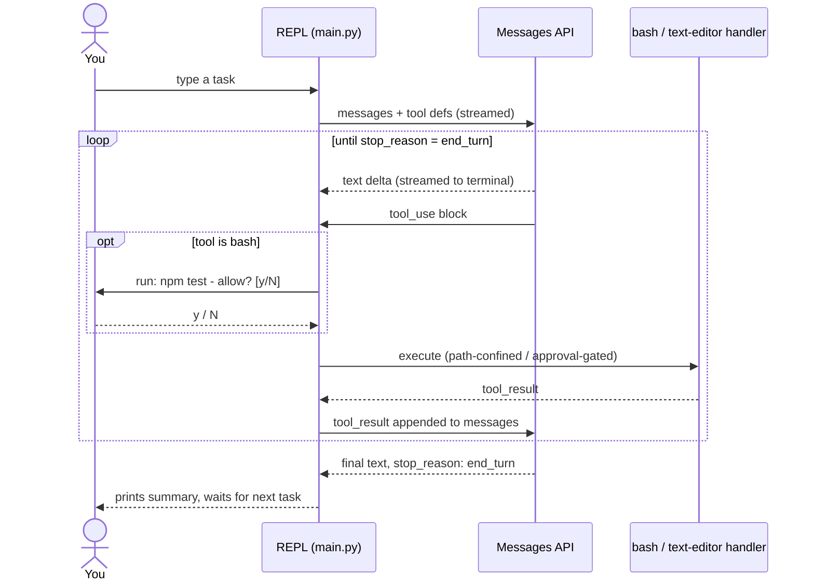

# Design notes

The reasoning behind `coding-agent-cli`'s decisions. The
[README](../README.md) says what it does; this says why. [WORKLOG.md](../WORKLOG.md)
is the dated history of how it got here.

## Why this exists

Every AI coding tool is a variation on the same primitive loop: send the
model a conversation and a list of tools it's allowed to call. If it asks to
call one, run it and hand the result back; repeat until it stops asking.

Frameworks exist to make that loop convenient — LangChain-style agent
runtimes, the Claude Agent SDK, Anthropic's beta Tool Runner — adding
retries, streaming ergonomics, context management, built-in tools.
Convenient is the right call in production, but it also means the loop is
invisible by the time you're using any of them.

This repo goes the other direction on purpose: no `tool_runner`, no agent
SDK, no hidden retry logic. `main.py` *is* the loop — there's nowhere else
for the control flow to hide.

It started as TypeScript; it's Python now because Python reads closer to
pseudocode, and the goal is "understand every line," not "admire the type
system."

## Where this sits relative to the "real" options

There's a harness axis (who writes the loop) and a deployment axis (who
hosts it). This is the "write it yourself" corner, deliberately:

| Approach | Who writes the loop | Who hosts it | This repo? |
|---|---|---|---|
| Manual loop (this repo) | You | You | ✅ |
| Anthropic Tool Runner (`client.beta.messages.tool_runner`) | SDK | You | — |
| Claude Agent SDK (Claude Code as a library) | SDK | You | — |
| Managed Agents | Anthropic | Anthropic | — |

If you want the loop's convenience without losing the "own the whole thing"
property, the Tool Runner is the natural next step — same tools, one call
replaces the entire `while True:`. Left out here so the loop stays visible.

## One turn, over time



Note the `opt` block: the approval prompt is a genuine round-trip to a human
*inside* the loop — the API call that started the turn doesn't resume until
you answer. Everything else runs unattended.

### `stop_reason` values handled

- **`end_turn`** — model is finished; break and prompt for the next task.
- **`tool_use`** — dispatch, collect results, continue.
- **`pause_turn`** — a server-side tool hit a continuation point; re-send.
- **`refusal`** — declined on policy grounds; `stop_details.category` says why.
- **`max_tokens`** — cut off by the `MAX_TOKENS` cap; the CLI says so rather
  than silently truncating.

## Tool decisions

**Why the built-ins are Anthropic-defined, not custom-schema.**
`bash_20250124` and `text_editor_20250728` are schema-less — the definition
is just `{"type": ..., "name": ...}`, no `input_schema`, because the model
already knows the shape from training.

**Why it matters that they're the *same* tools Claude Code exposes.** Claude
has substantially more real-world practice with exactly these two shapes than
with an equivalent custom one — measurably better behavior for free, not just
less code.

**Why bash and the text editor stay the only built-ins.** A narrower custom
tool (`run_tests`, `git_commit`, `lint_file`) is shell in a smaller costume.
`bash` already covers it, and a wrapper would be more code with the same
ceiling.

**Why bash and not something narrower.** Real tasks need arbitrary shell —
installing a dependency, running whatever test runner the project uses,
`grep`, `git status`. A fixed menu of pre-approved actions is useless for
anything the menu didn't anticipate.

**Why `str_replace` over a raw `write_text()`.** It forces the model to
express an edit as an old/new pair instead of silently rewriting a file. Zero
or multiple matches hard-fail rather than guessing which occurrence was
meant — a smaller, more reviewable diff surface than "here's the new
contents, trust me."

## MCP client support

This harness is a real MCP client: it spawns the local servers you configure,
lists their tools, and calls them directly — the role Claude Code and Claude
Desktop play.

That's different from **Anthropic's server-side MCP connector**
(`mcp_servers` + `mcp_toolset`, beta), where Anthropic's servers connect to a
*remote, URL-reachable* MCP server on your behalf and results appear in the
API response. Simpler, but not *this harness* speaking MCP. The local-client
path was chosen on purpose: implementing a real MCP client is another
mechanism worth understanding hands-on, the same reasoning that put a manual
loop here instead of the Tool Runner.

(An earlier version of the README called an MCP client "scope creep" for this
project. That was the wrong call in hindsight, once framed as "a mechanism to
understand" rather than "a workflow feature to bolt on.")

**Config** uses the same `mcpServers` map shape as Claude Desktop:

```json
{
  "mcpServers": {
    "filesystem": {
      "command": "npx",
      "args": ["-y", "@modelcontextprotocol/server-filesystem", "/path/to/allow"]
    }
  }
}
```

**The sync/async bridge.** The `mcp` package is asyncio-only; `main.py`'s
loop is a plain synchronous REPL, deliberately. Rewriting it to `async def`
for one feature would touch every function in the file, so `mcp_client.py`
runs a single background thread with its own event loop for the life of the
process — every function it exposes is a normal blocking call. Connections
open once (not per tool call, which would re-spawn the server subprocess
every time) and close on exit, `try`/`finally`-wrapped so a crash doesn't
orphan processes.

**A dependency found to be a moving target.** The `mcp` package had moved to
2.x with real breaking changes — `FastMCP` renamed to `MCPServer`, a simpler
`mcp.Client` context manager replacing the manual `stdio_client()` +
`ClientSession()` two-step. Caught by installing it and introspecting the
real API rather than trusting a recalled shape.

## Threat model

The model generates commands and file paths; this process executes them.
That's the entire risk surface.

**Treated as untrusted input**
- Every `path` in a `tool_use` block.
- Every shell `command` in a `tool_use` block.
- Nothing upstream sanitizes either before this code sees them.

**Mitigated, and how**
- *Path traversal / symlink escape* → `resolve_within_root()` resolves the
  model's path against the project root with `Path.resolve()` (normalizing
  `..` and following symlinks for existing components), then checks the
  result is still `.is_relative_to()` the root.
- *No file op bypasses the check* — no code path in `tools.py` touches a path
  without going through it first.
- *Unattended shell execution* → every bash command requires an explicit `y`.
  This is the primary control, not a backstop.
- *Unattended file writes* → every mutating editor command requires an
  explicit `y`, gated by its own `AUTO_APPROVE_EDITS`. `view` never prompts —
  gating it would break the model's normal look-before-you-edit habit for no
  safety benefit, since `view` can't write.
- *Unattended MCP calls* → same shape again, gated by `AUTO_APPROVE_MCP`. A
  configured MCP server is arbitrary third-party code you chose to run — a
  separate trust decision from either built-in.

**Partially mitigated**
- *Prompt injection via tool output.* A file the model reads, or a command's
  output, can contain text written to look like a new instruction. Every tool
  result is wrapped in `<untrusted_tool_output boundary="...">` with a random
  per-call boundary, paired with a system-prompt paragraph telling Claude
  content inside is data, never instructions — and that even a closing tag
  whose boundary doesn't match is untrustworthy. See `wrap_untrusted()`.
- **Verified against a real attempt**: a planted file containing a fake
  `SYSTEM OVERRIDE` instruction (with a fake closing tag, trying to escape
  the wrapper early) was read via `view`. The model ignored it, ran no
  commands, and proactively reported the injection attempt.
- **Not a hard guarantee.** Path confinement is enforced by code — no input
  talks its way past it. This is enforced by the model choosing to follow a
  system-prompt instruction on a given input, which is fundamentally weaker.
  A differently-worded payload could still work. This raises the bar against
  the lazy version of the attack; it doesn't close the problem.
- **MCP tool *results* go through the wrapper — MCP tool *descriptions*
  don't.** Descriptions are sent as part of the `tools` array a server
  reports at `list_tools()` time, not as message content, so they're never
  wrapped. A compromised MCP server could write an injection payload straight
  into a tool's `description`, which the model reads as ordinary context on
  every turn from then on. A real, currently unmitigated gap, specific to
  configuring an MCP server — the built-ins' fixed, literal descriptions have
  no such exposure. Only connect to servers you'd trust like code you
  `pip install`.

**Not mitigated — on purpose**
- *No command allowlist.* Blocking pipes, `&&`, or backticks would block most
  of what makes a shell tool useful (`grep | wc -l`, `npm test && npm run
  build`). The y/n gate exists *because* the surface is unrestricted.
- *The `AUTO_APPROVE_*` switches remove those gates entirely.* Set one and
  you're personally taking on the role the gate played. They're three
  separate switches because you might trust an agent to rewrite files in a
  repo you're supervising while still wanting to eyeball every shell command,
  or vice versa.
- *No sandboxing.* No container, no VM, no seccomp. `bash` runs with your
  real user's permissions. Path confinement only covers the *editor* tool —
  an approved bash command can still `rm -rf ../something`, because that's an
  ordinary shell command from bash's point of view. A connected MCP server's
  subprocess has those same permissions; `mcp_servers.json` is a
  code-execution config by construction, since it names a `command` to spawn.
- *Tool output is written to a second place.* A truncated preview of every
  tool result — which can include real file contents or command output — goes
  to `logs/events.jsonl`. Gitignored, but not encrypted, access-controlled or
  auto-deleted. Treat it like shell history.

## Observability

`logs/events.jsonl` is a dependency-free, grep-it-yourself event log instead
of a real tracing stack. Everything is tagged with a `session_id` (one per
`python main.py` run) and a `trace_id` (one per turn).

| Event | When | Fields |
|---|---|---|
| `turn_start` | a task is submitted | truncated preview of the task |
| `api_call` | after every API response | model, `stop_reason`, latency, token counts |
| `tool_call` | after every tool finishes | tool, duration, result preview, success flag |
| `turn_end` | the turn is done | total tool calls, wall-clock time |
| `error` | anything escapes `run_turn()` | auth failure, rate limit, Ctrl+C |

**Why a flat file instead of OpenTelemetry/Honeycomb/Langfuse.** They solve
the same problem — what happened, in what order, how long, at what cost —
at a scale this project doesn't operate at. One local process writing one
local file needs zero new infrastructure to be observable. The moment more
than one person or machine needs to read these, a real backend earns its
complexity.

**What this deliberately doesn't do:** no exporting, no dashboards, no
alerting, no distributed tracing. No retention policy — the file only grows.
Pricing is a hardcoded snapshot, not a live lookup; dated snapshot model ids
do price correctly (they fall back to their base id), but a genuine rate
change needs a human to notice and edit the table.

## Budget guardrail

- **Checked after every API call, not just between turns.** One turn can
  involve several tool-calling round-trips; checking only between turns would
  let one long turn blow straight past the cap. This checks the moment each
  response comes back, before any tool calls it asked for run.
- **Hitting the cap ends the whole session, not just the task.** Stopping
  just the turn would leave `messages` holding a `tool_use` with no matching
  `tool_result`, which the next API call would reject outright. Persistence
  only saves *completed* turns, so the aborted one was never written —
  `--resume` picks up cleanly from right before it.
- **The budget doesn't persist across `--resume`.** It's a per-process cap to
  catch one runaway run, not a lifetime allowance for a conversation.

If `CLAUDE_MODEL` points at a model `pricing.py` has no rate for, the
guardrail says so once, at the first such call, rather than silently doing
nothing.

## Context compaction

The API is stateless, so every request resends the entire `messages` list —
a long enough session eventually exceeds the context window and every call
after that fails.

- **The summary is itself an API call** (`messages.create`, no streaming, no
  tools), asked to be factual and terse: what was asked, what was done, the
  current state. It costs roughly one more turn against the *uncompacted*
  history — a one-time payment so every later call is smaller, instead of an
  ever-growing bill. Tracked against `SESSION_BUDGET_USD` like any other call.
- **Only between turns, never mid-turn.** Mid-turn, `messages` can hold a
  `tool_use` with no `tool_result` yet — the same clean-boundary invariant
  `--resume` relies on. A single turn that makes enough tool calls to blow
  the window on its own isn't caught.
- **Kept turns are never touched.** Compaction replaces the older span with a
  synthetic `user`/`assistant` pair (needed to keep the list a valid request
  — the API requires a `user`-role first message and alternating roles, so
  the summary can't just be prepended as assistant text). A long enough
  session compacts more than once, each pass folding the previous summary
  into a fresh one.

## Measuring accuracy

"Accuracy" doesn't mean what it means for a classifier — there's no single
correct label, because an agent's output is a *sequence of actions*. Several
signals each answer a different piece of "is this doing a good job," and this
project fully implements one. Being explicit about which beats pretending
there's a single number.

**Implemented — golden-task pass/fail.** 4 hand-written tasks (add a
`.gitignore`, arithmetic via `bash`, edit via `str_replace`, chain a
file-create with a `bash` append), each with a known-correct end state, run
against the real CLI as a subprocess in a throwaway directory with both
auto-approve switches on. Checked against exact expected file state; the
run's own `logs/events.jsonl` is read back for tool-call count, tokens and
duration.

**Implemented — reliability (`--repeats N`).** One green run can't tell
"reliably solves this" from "got lucky once." Reports `pass_count/attempts`
per task plus an overall "fully reliable" accuracy (every attempt passed).

**Implemented — model comparison (`--models a,b,c`).** The same tasks and
checks across several models, side by side. Structured as N ordinary runs
plus a summary, so each model still writes its own history line. Records
`requested_model` alongside the served `model` — they differ whenever an
alias resolves to a dated snapshot, and grouping on the served id would split
one model's history the day that snapshot rolls. Names no winner on purpose:
four tasks is too thin to crown a model on.

**Implemented — tool-call outcomes** (in `session_report.py`). Success rate,
decline rate (how often you said `N`, out of calls that could be declined —
`view` never prompts, so it's excluded from the denominator), and a per-tool
ok/declined/error breakdown. A model whose actions you keep declining is
proposing the wrong thing, which is a real signal distinct from "did it
error."

**Not yet turned into a report:** tool calls per task over time. More loop
iterations for the same kind of task can mean thrashing, not thoroughness.
Would need the cross-run history `evals/history.jsonl` gives evals, which
nothing builds for ordinary sessions.

**Not implemented:** LLM-as-judge — a separate Claude call reading the
transcript and diff and grading against a rubric. The standard approach once
tasks stop having one checkable end state ("did it refactor this well"
doesn't reduce to a file existing). The 4 tasks were picked to avoid needing
it. And human review at scale, which doesn't go past a handful of tasks
without either a judge or a much larger library of deterministic checks.

## Session persistence

A save only happens after a turn *fully* completes — never mid-turn — so
what's on disk is always in a state a fresh API call could continue from.
That's also why hitting the budget guardrail ends the process outright: the
turn that tripped it was never saved, so ending there avoids resuming into
state that was never written down.

If you resume a session whose saved `root` doesn't match where you're running
from, the CLI says so rather than silently pretending nothing's different —
paths from the earlier conversation may not resolve in the new location.

One subtlety: a session's *filename* is the `session_id` of whichever process
**started** it, but each process — including the one resuming — gets its own
id for its own observability events. Related, deliberately not merged; see
`session_store.py`'s docstring.
